#  **ABSTRACT**

This mobile application project is developed to address waste and complaint management challenges faced by WSSCs (Water and Sanitation Services Companies) in KPK. It provides an accessible, user-friendly platform for citizens to report issues related to garbage, sanitation, water supply, WSSC staff, and other relevant concerns directly from their mobile devices. The app automates and streamlines the previously manual complaint process, improving user experience and efficiency.

Key features of the mobile app include an intuitive interface that simplifies complaint registration, a centralized database for efficient complaint management, and built-in communication channels between citizens and WSSC authorities. Users can easily select complaint types, provide descriptions, and attach photos or videos to support their reports. Additionally, the app tracks the status of each complaint and sends notifications to keep users informed about the progress and resolution.

Future plans include deeper integration with WSSC infrastructure, advanced reporting and analytics, expansion to additional WSSCs, and community engagement features. By leveraging these capabilities, the app aims to offer a robust and adaptable solution for efficient waste and complaint management across a wider region.

## 
#  **INTRODUCTION**

People living on earth depend on nature to provide them with the
resources they need to survive: air, water, food, fibre, medicines, and
building materials. As humans, we are responsible for distorting the
real value of nature, not only for ourselves but for future generations.
Pakistan generates approximately 49.6 million tons of solid waste
annually, with a 2.4 million ton increase in solid waste generated each
year. In comparison to other developing countries, Pakistan has very
poor waste management infrastructure, and waste is irregularly collected
and improperly treated, leading to serious environmental and health
problems. As a result, garbage accumulates on roadsides, in sewers, and
in other public areas, and it has become commonplace to incinerate
garbage, resulting in the release of dangerous toxins and threatening
human and environmental health. Of the few existing landfills, even
fewer are operational. Uncollected waste is creating serious public
health risks by clogging drains, forming stagnant pools, providing
breeding grounds for mosquitoes and flies, and leading to the risk of
malaria and cholera.

Pakistan is a developing country, and the main problem with garbage
collection is that most of the garbage is not collected, when
municipalities take care of disaster areas, some places are overlooked,
and garbage continues to pile up.

Furthermore, more than half of the people in Pakistan are facing serious
sanitation problems as well. A very large percentage of people are
deprived of clean water, leading to serious health conditions. There is
a lack of awareness about how severe garbage and water sanitation
problems can become for healthy survival. The waste and water problems
persist, but the main issue lies in the lack of management in Pakistan.
Management encompasses staff handling the issues and raising awareness,
among other aspects.

To solve these issues, we have developed a system that allow citizens to
make complaints of different types, which highlights problems faced by
common citizens.

##
# **PROBLEM STATEMENT**

Most Pakistani cities lack effective waste management systems, from
collection to disposal. Due to a shortage of disposal locations, a lot
of the collected garbage ends up in dumping grounds, uncovered holes,
and rivers, which sadly leads to a variety of health and water-related
issues.

There can be possible situations, such as where there are some areas
where collection points are not available, and in that case, people are
forced to throw the garbage on roads, streets, and in the middle of the
city. The second situation might be where people suffer due to the
irresponsible attitude of the staff. The main aim of our project is to
allow citizens to make complaints of different types regarding trash,
water-related issues, and complaints related to staff, which somehow
highlight the problems faced by the common man. In our country, there
are different waste management apps available, but each app has
different outcomes. Keeping in view the illiteracy rate in our country,
our people always need a solution that is user-friendly and easy for
them to tackle their problems with. The running systems could be more
user-friendly and functional, which is an obstacle for different types
of users to use. WSSC is a bi-country governmental agency in KP, that
has a manual complaint system, the user first needs to make a call to
file the complaint, and the rest of the process is also manual.

We intend to develop a system that makes it easy for the user to use and
put their problems forward.

##
# **PROPOSED SOLUTION** 

To solve the above issues, we have developed a system that aims to
revolutionize the operations of all water and sanitation services
companies (WSSCs) across KPK by introducing a comprehensive digital
solution in the form of a Mobiel App. Our solution
encompasses various crucial aspects, including the management of
complaints related to solid waste, water sanitation, miscellaneous
issues, and other categories falling within the purview of WSSC's
organizations. Moreover, it facilitates the effective supervision of
personnel, tracking citizen feedback, and monitoring employee activities
and responsibilities. This project seeks to elevate the overall
performance of WSSCs, enabling them to deliver exceptional services to
their respective communities.

## 
# **SCOPE**

-   This system is a generic system developed for all the WSSCs.

-   This system allows citizens to file various types of complaints,
    including those related to water supply, solid waste, wastewater,
    WSSC staff, miscellaneous issues, and other categories falling
    within the purview of WSSC organizations.

-   This system provides a mode of communication between citizens and
    relevant WSSC organization through filing complaints, addressing,
    and managing them.
## 

#  **OBJECTIVES**

The main objectives of our proposed system are as follows:

-   To develop a complaint management system for all WSSCS in KPK.

-   To integrate with their existing systems.

-   To equip citizens with a functional and convenient app to file
    complaint.

#  **Screenshots**

| Login      | SignUp      | Citizen Home Screen      | Citizen Complaint Form | Citizen Filed Complaints      |
|:-------------------------:|:-------------------------:|:-------------------------:|:-------------------------:|:-------------------------:|
| 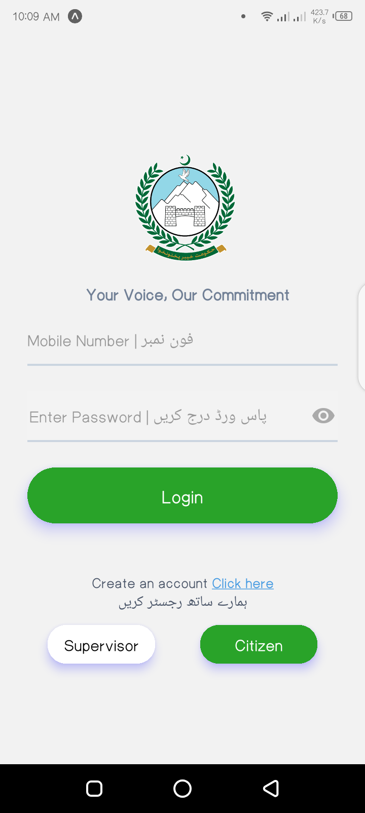 | 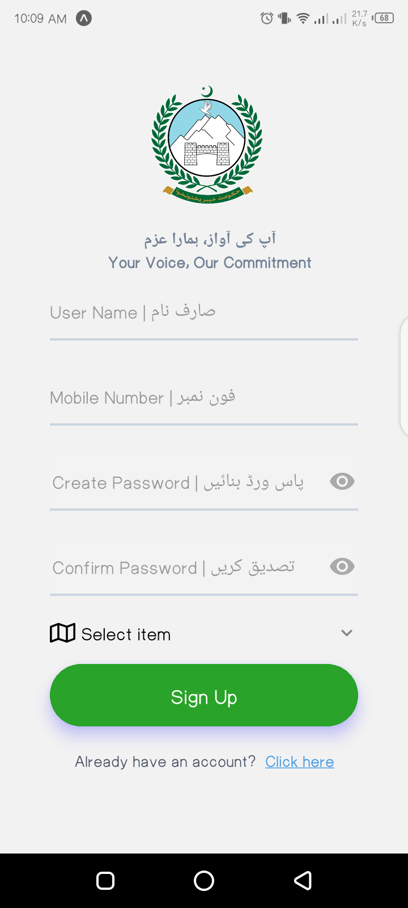 | 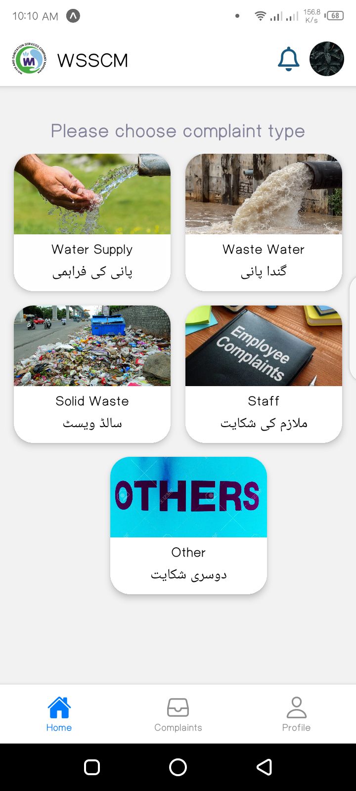 | 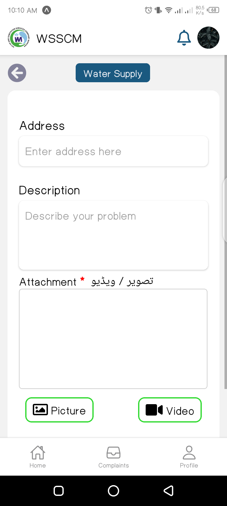 | 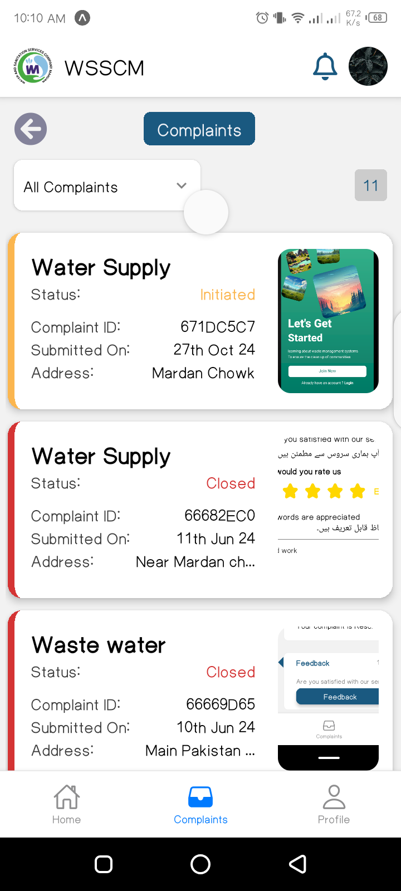 |

| Complaints Tracking      | Complaint Tracking      | Feedback by Citizen      | Citizen Profile      | Update Password      |
|:-------------------------:|:-------------------------:|:-------------------------:|:-------------------------:|:-------------------------:|
| 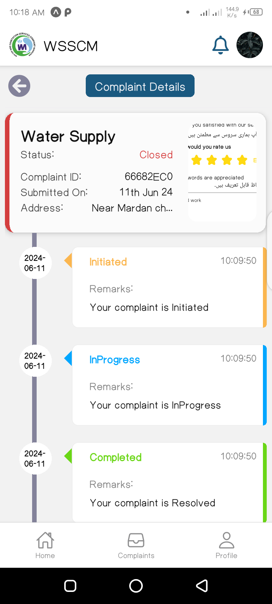 | 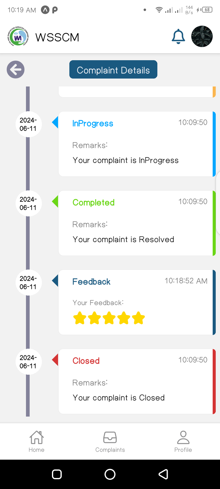 | 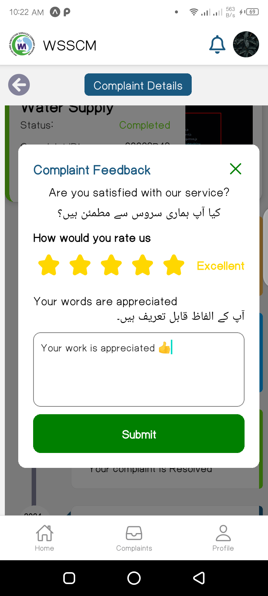 | 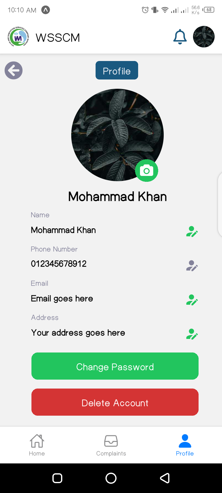 | 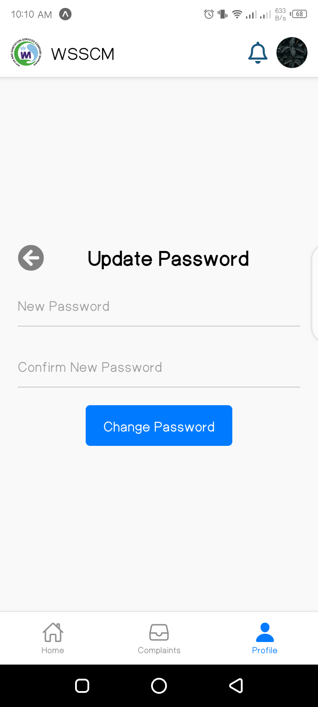 |

| Delete Account      | Supervisor Home Screen     | Supervisor Complaint Form     | Supervisor Complaint Form     | Supervisor Profile     |
|:-------------------------:|:-------------------------:|:-------------------------:|:-------------------------:|:-------------------------:|
| 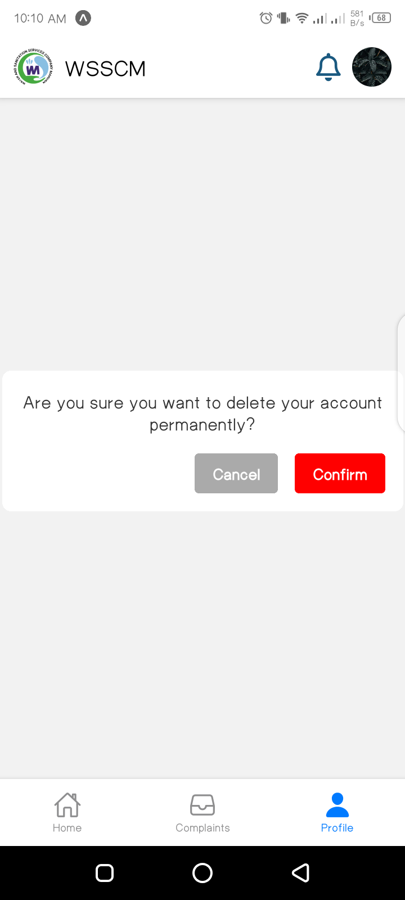 | 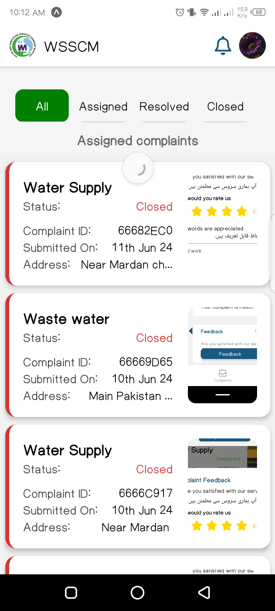 | 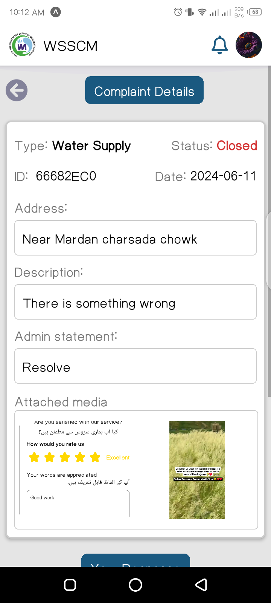 | 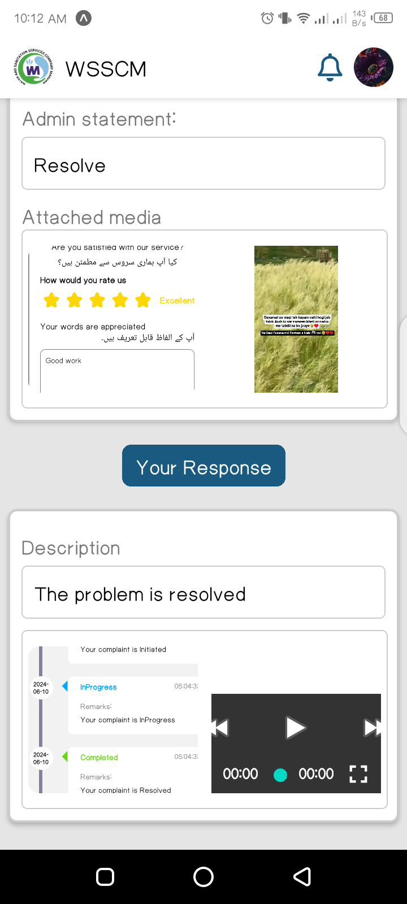 | 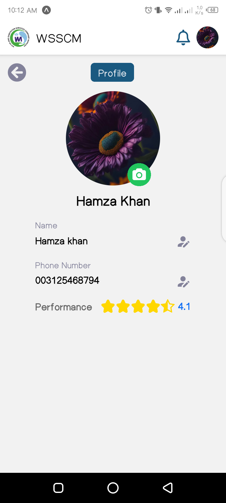 |

